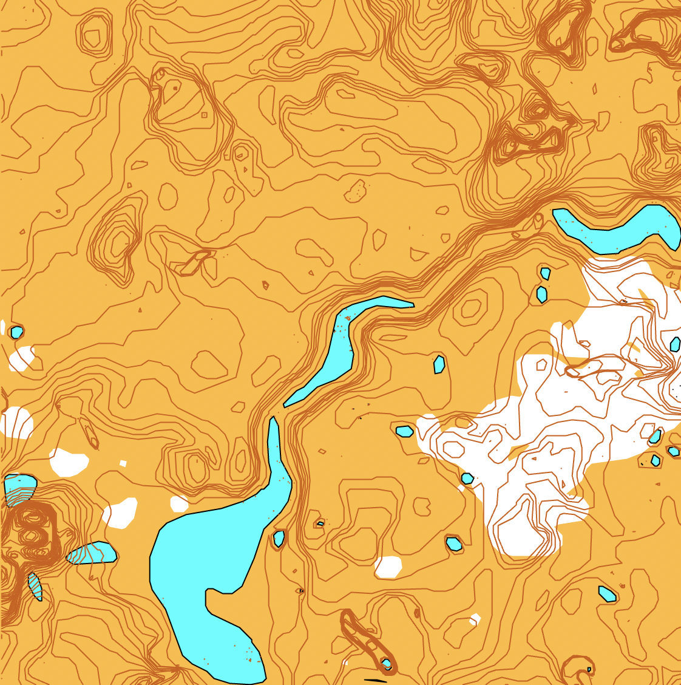

# TopoMC



TopoMC is a collection of R and python scripts that use the data from your Minecraft worlds to create beautiful topographical maps. TopoMC supports all Minecraft versions from 1.9 up to the current release (1.20.1), excluding 1.18-based versions (for now).

## Installation and running

### Requirements

- Python >= 3.9
  - [pipenv](https://pipenv.pypa.io/): `pip install pipenv --user`
- R >= 4.1.0
  - [renv](https://rstudio.github.io/renv/): (R shell)> `install.packages("renv")`

### Instructions

1. Make sure you have all requirements installed
2. Clone the repo and `cd` to `scripts` directory (you may need to set the file permissions to be executable, `chmod +x *`)
3. Run `./install` to install dependencies
4. Run `./generate` to generate the required `.tif` files into the `data` folder
5. Run `./map` to open the map of the Minecraft world in your web browser

> NB: When running `./generate`, all bounded chunks need to have been loaded. This means you may have to open the world in-game and walk around in order to load the chunks you want to map.

The map can be opened at any time without re-rendering by opening the **map.html** file created in the root directory of the project.

### Synopsis

`./generate x1 z1 x2 z2 [--world worldname] [--settings path/to/settings.yml]`

- (`x1`, `z1`) - Top left chunk
- (`x2`, `z2`) - Bottom right chunk

### Options

- `-w, --world` World to use. If not specified the world named "_New World_" will attempt to be mapped
- `--settings` Path to a `.yml` file (relative to root directory of project, regardless of where you are running the scripts from) with more advanced settings like if you are using a third party launcher and have a non-standard minecraft saves directory

Example settings.yml:

```yml
Saves path: "/Applications/MultiMC.app/Data/instances/topomc/.minecraft/saves"

Surface blocks:
  - "grass_block"
  - "grass_path"
  - "dirt"
  - "coarse_dirt"
```

### Example

`python -m topomc -255 -255 255 255 --world MyWorld --settings MySettings.yml` (Assuming there is a valid world called _MyWorld_ and a settings file in the root directory of the project called _MySettings.yml_)

## Contributing

Feel free to create a PR at any point, or add an issue if you have any problems or suggestions.

## How it Works

Firstly the raw chunk data needs to be read and processed. This is done by opening the minecraft world save directory and reading the region files (`.mca`) for a world save. The data in these files is processed by the **anvil-parser** python library. This may change in the future.

Once the region data is decoded chunks can be iterated through in order to find ground blocks (can be changed by passing a custom settings file). To make this process more efficient, the loop can take advantage of precomputed heightmaps. These heightmaps contain info such as the y-level of the first motion-blocking minecraft block. By starting the loop from the height precalculated by these heightmaps, efficiency is greatly improved.

After the chunks are read several `.tif` files are saved in a folder called `data` at the root directory of the project. These files contain the raw data extracted from the minecraft files that is needed to create the topographical map. `.tif` files are chosen as they are cross-compatible and effective data matrix format.

The `./map` script runs the R spatial processes which format the data into a presentable and interactive map, which opens in the default web browser after the data processing is complete.
